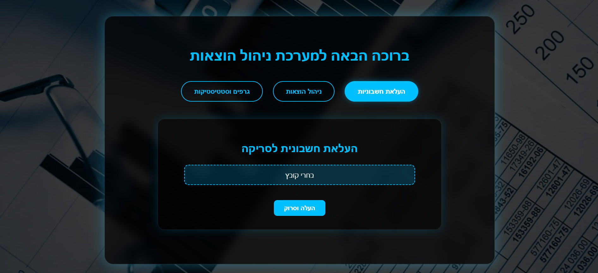
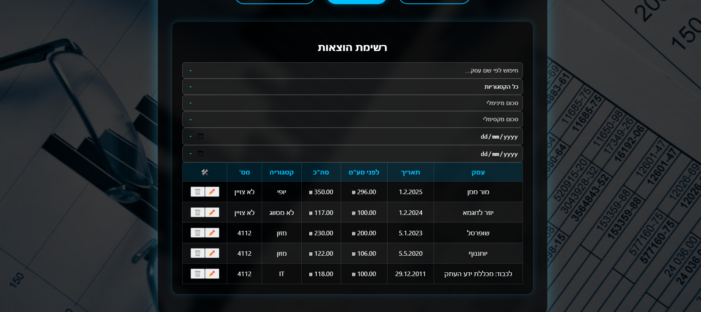
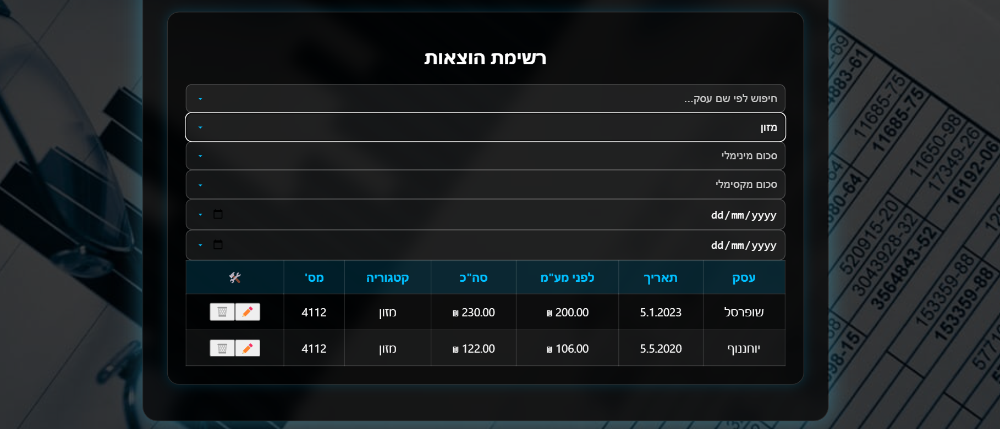

## 💻 Invoice-Classifier-Frontend

Frontend for the BusyMatch project – a responsive React web app for tracking expenses and uploading invoices with OCR. The app connects to the BusyMatch backend API and supports user authentication, expense categorization, and data visualization.

### 🚀 Key Features

- 📤 Upload invoices (PDF/images) and extract data via OCR
- 📊 Display categorized expenses in tables and graphs
- 🔐 User login and registration with JWT-based authentication
- 🎯 Responsive UI with Tailwind CSS
- 🔍 Filter, search, and edit expenses

---

### 🛠️ Technologies

- React (TypeScript)
- Tailwind CSS
- Recharts (for charts)
- Axios (for HTTP requests)
- React Router
- JWT stored in LocalStorage

---

### ▶️ Running Locally

1. **Clone the repository:**

```bash
git clone https://github.com/shirzohar/busymatch-frontend.git
cd busymatch-frontend
```

2. **Install dependencies:**

```bash
npm install
```

3. **Set environment variables:**

Create a `.env` file in the root with:

```env
REACT_APP_API_BASE_URL=http://localhost:5000/api
```

4. **Run the app:**

```bash
npm start
```

The app will run at `http://localhost:3002`

---

### 📂 Project Structure

```plaintext
├── src/
│   ├── components/       # Reusable components (forms, tables, charts)
│   ├── pages/            # Main screens (Login, Dashboard, Upload, etc.)
│   ├── services/         # Axios API services
│   ├── utils/            # Helper functions
│   ├── App.tsx           # Main app routing
│   └── index.tsx         # Entry point
├── public/
├── .env
├── tailwind.config.js
├── tsconfig.json
```

---

### 🖼️ Screenshots

#### 🔐 Login Page


#### 🔐 Register


#### 📤 Upload Invoice



#### 📋 Expenses Table



#### 🔍 Search and Filter



#### 📊 Expense Charts


---

### 📬 Author

**Shir Zohar** – [GitHub](https://github.com/shirzohar)
